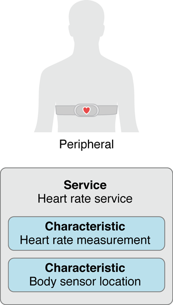
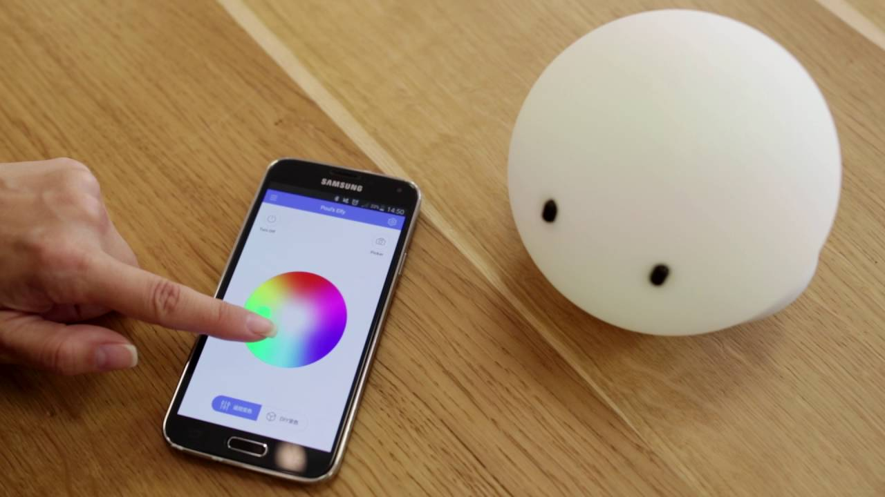
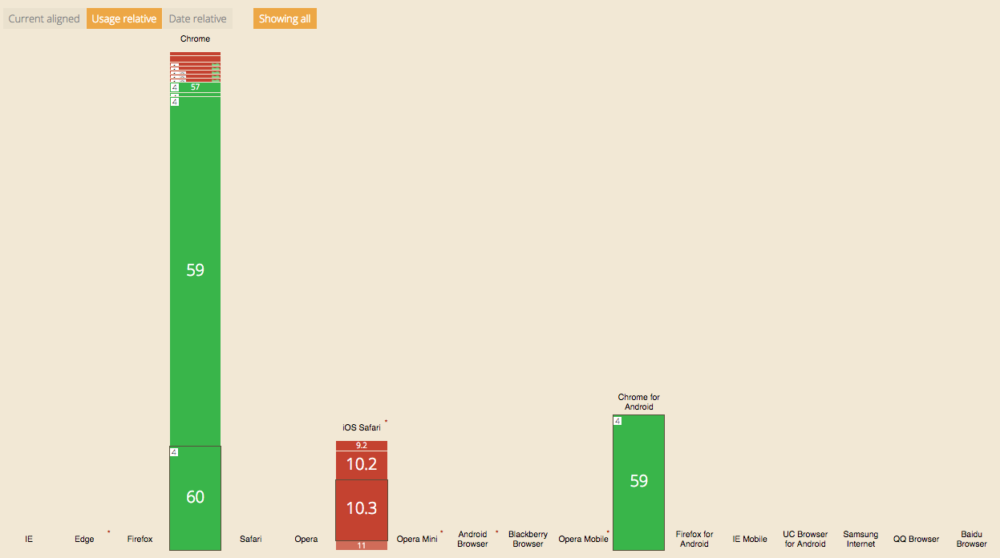
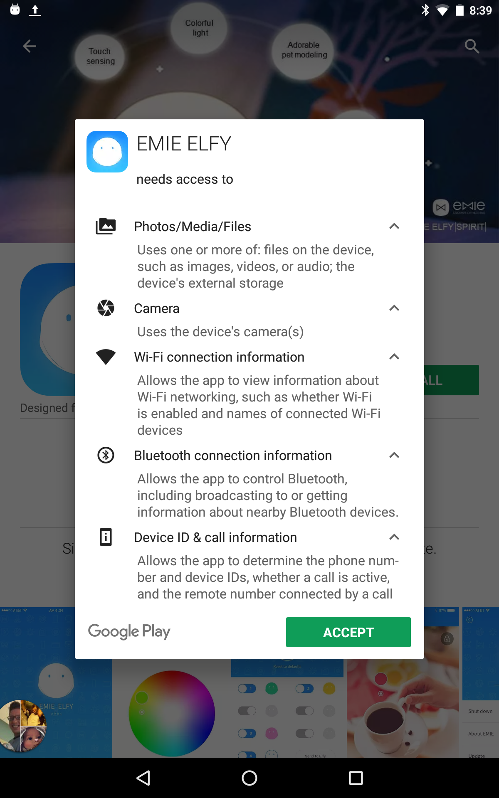
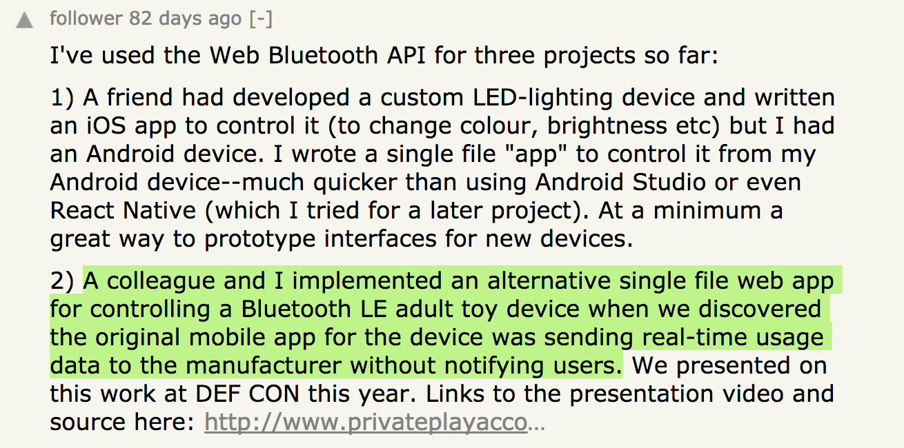

class: center, middle

# Web Bluetooth

## @mattdsteele

---
class: center, middle

# meh.

---

class: center, middle


---
class: center, middle


---
class: center, middle


---
class: center, middle


---
class: center, middle


---
class: center, middle


---

# I have more Bluetooth than teeth

---

class: middle

# Separate app for each

---
class: center, middle


---
# Enter Web Bluetooth

---
class: middle, center
# Internet of JavaScript Things

---


## (aka Bluetooth Low Energy, Bluetooth 4.0)

???
Most newer devices support this
Bluetooth 4, usually (1mbps)
Speakers, game controllers, etc usually not (BT Classic, 24mbps)

---
class: middle, center


???
GATT protocol
GATT server, contains 1+ "services"
serial number, battery, other stuff
services contain characteristics, live information

---
# API

```javascript
navigator.bluetooth
```

---
class: wide-code
## Scan for services

```
if ('bluetooth' in navigator) {
  navigator.bluetooth.requestDevice({
  });
}
```

---
class: wide-code
## Scan for services
```
if ('bluetooth' in navigator) {
  navigator.bluetooth.requestDevice({
    filters: [{
      services: [
        'battery_service'
      ]
    }]
  });
}
```

???
If well-defined service, can access it directly

---
class: wide-code
## UUIDs
```
if ('bluetooth' in navigator) {
  navigator.bluetooth.requestDevice({
    filters: [{
      services: [
        '28998e03-c277-48a8-91cb-b29ab0f01ac4'
      ]
    }]
  });
}
```
???
Otherwise, need to specify the UUID
---
class: center


---
class: wide-code
## The rest of the ceremony
```
navigator.bluetooth.requestDevice({
  filters: [{
    services: [ '28998e03-c277-48a8-91cb-b29ab0f01ac4' ]
  }]
})
.then(device => {
  console.log(device.name);
});
```

---
class: smaller-code wide-code
## The rest of the ceremony
```
.then(device => device.gatt.connect())
.then(server => {
  return server.getPrimaryService('battery_service');
});
```

---
class: smaller-code wide-code
## The rest of the ceremony

```
.then(device => device.gatt.connect())
.then(server => server.getPrimaryService('battery_service'))
.then(service => service.getCharacteristic('battery_level'))
.then(characteristic => characteristic.readValue())
.then(value => {
  console.log(`Battery level is ${value}%`); // <-- Uint8Array!
})
.catch(e => { console.error(e) });
```

---
class: smaller-code wide-code
## The rest of the ceremony

```
try {
  const server = await device.gatt.connect();
  const service = await server.getPrimaryService('battery_service');
  const characteristic = await service.getCharacteristic('battery_level');
  const value = await characteristic.readValue();
  console.log(`Battery level is ${value}%`); // <-- Uint8Array!
} catch(e) {
  console.error(e);
}
```
???
I find it easier using async/await

---

name: deviceInfo

## Device Info

<button class="device">Connect</button>

<pre class="device-info"></pre>

---

# Listening for Events

---
class: smaller-code wide-code
## One-time read

```
characteristic.addEventListener('characteristicvaluechanged', event => {
  const value = event.target.value;
  console.log(value);
});
```

---
class: smaller-code wide-code

## Notifications/Indications

### AKA Multiple Reads

```
characteristic.addEventListener('characteristicvaluechanged', event => {
  const value = event.target.value;
  console.log(value);
});
```

---
class: smaller-code wide-code

## Notifications/Indications

### AKA Multiple Reads

```
await characteristic.startNotifications();
characteristic.addEventListener('characteristicvaluechanged', event => {
  const value = event.target.value;
  console.log(value);
});
```

---
name: hrDemo
class: smaller-code wide-code

## Heart Rate <button class="hr-button">Connect</button>

```
const device = await navigator.bluetooth.requestDevice({
  filters: [{ services: ['heart_rate'] }] 
});
const server =  await device.gatt.connect();
const service = await server.getPrimaryService('heart_rate');
const characteristic = await service.getCharacteristic('heart_rate_measurement');
await characteristic.startNotifications;
characteristic.addEventListener('characteristicvaluechanged',
  handleCharacteristicValueChanged);
```


<h3 class="heart-rate">Current HR</h3>

<pre class="hr-status"></pre>

---
class: middle center


???
Another one of my purchases. It's got an app that sends push notifications to you
when it reaches a certain temperature. 

You know, for all those times where you're doing cooking with precise timing,
but you want to binge the last 3 Jessica Jones episodes.

---
name: bbqRaw
class: smaller-code wide-code

## Raw Data

```
q.onUpdate(value => {
  const arr = new Uint8Array(value.buffer);
  const items = [];

  for (let i = 0; i < value.byteLength; i++) {
    items.push(padStart(arr[i].toString(16), 2, '0'));
  }

  update(selector, items.join(' '));
}); 
```


<h3 class="thermometer-1">Sensor 1</h3>

???
Here's the data it produces. But what does it mean?

---
class: middle center
# Parsing Data

### *I hope you like bitwise operations*

---

# Read the specs

## *If you're lucky*

---


---
## More likely, on your own

--

```
21 01 03 00 00 00 00 00 00 00 aa 05 d1 02 ff ff
```

--

* ## 65°: `a0 02` 
--

* ## 72°: `d3 02` 
--

* ## 77°:  `fe 02` 

--
* ## 83°: `3b 03` 

---
class: wide-code
## Little Endian Notation

```
21 01 03 00 00 00 00 00 00 00 aa 05 d1 02 ff ff
```

```
char.addEventListener('characteristicvaluechanged', e => {
  const { value } = e.target;
  console.log(value.getUint16(12, true)));
});
```

---
name: bbqParsed

<h2 class="bbq-parsed-raw"></h2>

<h1 class="bbq-parsed-parsed"></h1>

---
name: startTdd
class: middle center
# Let's Do TDD
--

## (Thermometer-Driven-Deck)

---
class: center middle
name: angleFinder

# Bluetooth Angle Finder


<h2 class="anglefinder-raw"></h2>

---
name: angleFinderParsed
## Reading Strings

```javascript
char.addEventListener('characteristicvaluechanged', e => {
  const { value } = e.target;
  const decoder = new TextDecoder('utf-8');
  console.log(decoder.decode(val));
});
```

<h2 class="anglefinder-parsed"></h2>

---
class: center middle
# Writing Data

## *I hope you like `ArrayBuffer`s*

---
class: wide-code
# Writing Data

```
const command = new Uint8Array([0xa, 0x5, 0x3, 0x4]);
await characteristic.writeValue(command);
console.log('Wrote a value');
```

---
class: middle
```javascript
new Uint8Array([0xa, 0x5, 0x3, 0x4]);
```

---
class: center

???
So this is the elfy
---
class: center

---
class: center middle full-img

---
class: center middle full-img

---
class: center middle

---
class: middle center
# Find the Specs
---
class: middle center
)
---
class: middle center
# Guess

---
class: center
## iOS: LightBLE
  
---
class: center
## Android: nRF Connect


---
class: middle center
# Reverse Engineer it
---
class: center no-padding
   
---
class: center
## Wireshark


---
class: smaller-code wide-code
## End Result
```
async writeColors(r, g, b) {
  const colors = [r, g, b]
    .map(e => e / 16)
    .map(e => Math.floor(e));

  // aa 16 0r 0g 0b
  const command = new Uint8Array([0xaa, 0x16].concat(colors));

  const service = await this.device.gatt.getPrimaryService('6e402001-b5a3-f393-e0a9-e50e24dcca9e');
  const characteristic = await service.getCharacteristic(  '6e402002-b5a3-f393-e0a9-e50e24dcca9e');
  await characteristic.writeValue(command);
}
```
---
name: elfy

# Elfy

<label>Elfy Color: <input type="color" class="elfy-input"></input></label>

---
class: center middle
# Reactive Bluetooth Programming

## *Everything is a stream*

---
name: xstreamBbq
class: smaller-code wide-code

## Input as a stream

```
import fromEvent from 'xstream/extras/fromEvent';

const reading$ = fromEvent(char, 'characteristicvaluechanged');
reading$
.map(({ target: { value } }) => value.getUint16(12, true))
.map(e => e / 10)
.compose(dropRepeats())
.addListener({
  next(val) {
    update('.bbq-stream', `Reading: ${val} degrees`);
  }
});
```

<h3 class="bbq-stream"></h3>

---
exclude:true
## Output to a reactive component

CODE react component IF I GET TO IT

(Preact component for thermometer)

---
class: middle center
# Bike speed/cadence 

---
class: center

---

class: center


---
name: rawCycling
class: smaller-code wide-code


## Raw Data

```
const server = await this.device.gatt.connect();
const service = await server.getPrimaryService('cycling_speed_and_cadence');
this.char = await service.getCharacteristic('csc_measurement');
await this.char.startNotifications();

fromEvent(this.char, 'characteristicvaluechanged')
.map(({ target: { value } }) => {
  return value;
});
```
<code><h3 class="raw-cycling"></h3></code>

---

---
class: smaller-code wide-code
## Parsing Data
.split[
.half[

]
.half[
```
parsedMeasurement$() {
  return fromEvent(this.char, 'changed')
  .map(({ target: { value } }) => value )
  .map(data => {
    const flags = data.getUint8(0);
    const wheelDataPresent = flags & 0x1;
    const crankDataPresent = flags & 0x2;
```
]
]
---
class: smaller-code middle
## Parsing Data
.split[
.half[

]
.half[
```
const output = {};
if (wheelDataPresent) {
  const revs = data.getUint32(1, true);
  const lastWheel = data.getUint16(5, true) / 1024;
}
```
]
]
---
class: smaller-code middle
## Parsing Data
.split[
.half[

]
.half[
```
if (crankDataPresent) {
  const totalCranks = data.getUint16(7, true);
  const lastCrank = data.getUint16(9, true) / 1024;
}
```
]
]
---
name: streamCycling
## Semi-Parsed
<pre>
  <code class="parsed-cycling"> </code>
</pre>

---
```
{
  "totalRevolutions":27,
  "lastWheelTime":25.7900390625,
  "totalCrankRevolutions":23,
  "lastCrankTime":32.216796875
}
```
---
class: center middle
## Pairwise Streams


---
class: smaller-code wide-code
```
parsedCadence$() {
  const cadence$ = this.parsedMeasurement$()
  .map(({ totalCrankRevolutions, lastCrankTime }) => {
    return { totalCrankRevolutions, lastCrankTime }
  })

  .compose(pairwise)

  .map(([prev, curr]) => {
    const revDelta = curr.totalCrankRevolutions - prev.totalCrankRevolutions;
    const timeDelta = curr.lastCrankTime - prev.lastCrankTime;
    return { revDelta, timeDelta };
  })

  .map(({ revDelta, timeDelta}) => {
    const minuteRatio = 60 / timeDelta;
    return revDelta * minuteRatio;
  });
}
```

---
class: smaller-code wide-code
```
parsedSpeed$() {

  .map(({ revDelta, timeDelta}) => {
    const wheelSize = 622; // mm; 700C
    const wheelCircumference = Math.PI * wheelSize;

    const rpm = revDelta * (60 / timeDelta);
    const rph = rpm * 60;
    const mmph = rph * wheelCircumference;
    const kph = mmph / 1e6;
    return kph;
  });

}
```

---
name: cadenceAndSpeed
# Cadence And Speed
<h2 class="cadence-calc"></h3>

<h2 class="speed-calc"></h3>
---
class: center middle
# [Flappy Bike](game.html)
---
name: flappy
class: center middle
<div class="flappy-bike"></div>
---
class: center middle
# Browser Support
---
class: center middle

---
class: full-img middle

---
class: center middle
# Security
---
class: center middle

---
# Security

--
## HTTPS
--

## Bluetooth Low Energy
--

## Requires user interaction
--

## Sensitive services blacklisted
---
class: center middle
# okay but why

---
class: center middle
# Warranty Voider
---
class: center middle
<video src="vid/cloudpets.mp4" controls></video>
https://youtu.be/5pQt6Aa3AVs
---
class: center middle

---
class: center middle
# Privacy
---
class: full-img middle

---
class: middle center

---
class: middle center

---
class: middle center

???
Data breach can be more nefarious
---
class: center middle
# Control Your Devices
---
class: center middle
# Physical Web Interop
---
class: center middle
<video src="vid/physical-web.mp4" controls></video>
https://youtu.be/DCri83kUS7M
---
class: center middle
# Reduce friction

---
class: center middle
## Kinomap

---
class: center middle
# Weirdo Projects Are Fun
---
class: center middle

---
class: center middle

---
class: center middle
<video src="vid/bb8.mp4" controls></video>
---
class: center middle

---
class: center middle bigvid
<video src="vid/bike-lghts.mp4" controls></video>
---
class: center middle
# Happy Hacking
---
class: center middle
# @mattdsteele

## matt.steele.blue/web-bluetooth

---

[devgoogle]: https://developers.google.com/web/updates/2015/07/interact-with-ble-devices-on-the-web
[browsers]: https://github.com/WebBluetoothCG/web-bluetooth/blob/master/implementation-status.md
[services]: https://www.bluetooth.com/specifications/gatt/services
[cloudpets]: https://www.contextis.com/resources/blog/hacking-unicorns-web-bluetooth/
